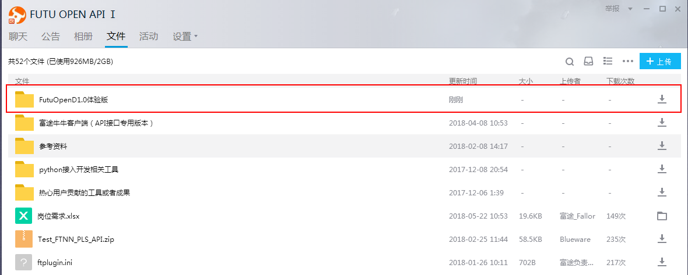

====
安装指南
====

------------------------------

--------
环境搭建
--------

.. note::

    *   Windows 7/10 ，64位操作系统
    *   安装要求使用Anaconda python 3编程环境，以避免因为环境问题出现运行失败的情况
    *   如果安装过程中遇到了问题，先阅读该文档下面的 Q&A 章节来尝试着解决

* 安装 Annacoda

Anaconda python是Python科学技术包的合集，提供了很多用于科学计算的模块。

下载地址：https://www.anaconda.com/download/

.. note::

    *   如果已经安装了Anaconda python2，也可安装Anaconda python3，在运行时切换环境。
    如下内容提供了两种方式切换为Anaconda3环境：
	
    *   方式一
    从path环境变量配置anaconda3环境。
    Step1、进入环境变量配置界面，创建变量ANACONDA3_HOME，变量值就是anaconda3的安装目录，如下图：
	
    .. image:: ../_static/version-Switching-path.png
	
    Step2、编辑path变量的值，删掉原python安装目录的路径并添加如下字符，保存即可：
    %ANACONDA3_HOME%;%ANACONDA3_HOME%\Lib;%ANACONDA3_HOME%\Library\mingw-w64\bin;%ANACONDA3_HOME%\Library\usr\bin;%ANACONDA3_HOME%\Library
    \bin;%ANACONDA3_HOME%\Scripts;
	
    .. image:: ../_static/version-Switching-paste.png
	
    Step3、再次验证anaconda3环境是否生效。
    .. image:: ../_static/version-Switching-verification.png   
	
    *   方式二
    配置pyChram使用的环境为anaconda3。
    .. image:: ../_static/version-Switching-pycharm.png

    

当安装成功后，执行如下命令来查看是否安装成功:

.. code-block:: bash

    conda -V
    

* 安装 futuquant 库

方式1：

.. code-block:: bash

    $ pip install futuquant
    
    
方式2：直接在GitHub下面下载FutunnOpen包，进行安装

.. note::

    *   下载地址：https://github.com/FutunnOpen/futuquant
       .. image:: ../_static/git-download.png    
    *   解压，在解压文件夹按住Shift右键打开PowerShell或命令窗口，执行 :code:`pip install .` 进行安装
       .. image:: ../_static/powershell-install-futuquant.png

* 安装 TA-Lib

TA-Lib 用中文可以称作技术分析库，是一种广泛用在程序化交易中进行金融市场数据的技术分析的函数库。它提供了多种技术分析的函数，方便我们量化投资中编程工作。

.. code-block:: bash

    $ pip install TA-Lib
  
如果发现无法通过 pip 安装，请访问 https://mrjbq7.github.io/ta-lib/install.html 解决。  
    
对于 Windows 用户，如果编译困难，可以根据您本地的Python版本下载指定的whl包，然后 :code:`pip install TA_Lib-0.4.9-cp27-none-win_amd64.whl` 来完成安装。

.. note::

    *   下载地址：https://www.lfd.uci.edu/~gohlke/pythonlibs/
    *   安装TA-Lib非必须，可先跳过该步骤
    

* 安装 PyCharm

下载地址：https://www.jetbrains.com/pycharm/download/

.. note::

    *   有众多Python IDE（集成开发环境）可以供您选择，但我们强烈推荐您使用PyCharm
    *   选择community版本即可，如您有需要也可以购买专业版（可免费试用）
  
    

--------------

--------
安装 FutuOpenD
--------

方式1：`富途官网下载 <https://www.futunn.com/download/index/>`_ 

.. image:: ../_static/futunn.com.png

方式2：QQ群文件下载

--------------

